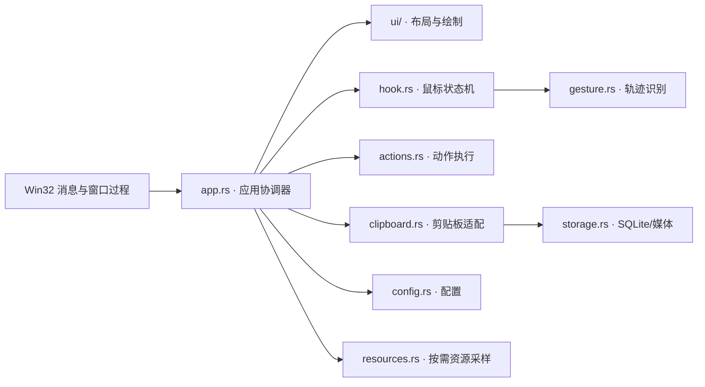
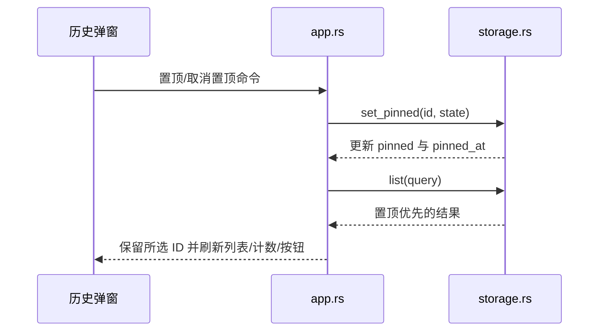

# Xmouse 工程架构

## 设计原则

Xmouse 是单进程、事件驱动的 Windows 原生程序。工程优先保证低常驻开销、安全的跨线程边界和可独立测试的核心逻辑。UI 层负责显示与输入转发，不直接实现手势识别、剪贴板持久化或动作执行。

## 模块边界

| 模块 | 责任 | 不应承担 |
| --- | --- | --- |
| `app.rs` | 生命周期、窗口过程、状态协调、命令路由 | 控件布局细节、图片解码、数据库 SQL |
| `ui/settings.rs` | 设置页结构和控件句柄集合 | 配置持久化和业务判断 |
| `ui/gesture_editor.rs` | 个性化轨迹画布、命中区域和纯绘制 | 配置写入和手势执行 |
| `ui/history_popup.rs` | 历史弹窗布局、搜索/列表/操作控件 | 历史查询和置顶写入 |
| `ui/history_preview.rs` | 大图缩放、Alpha 合成和预览窗绘制 | 磁盘查询和悬停状态判断 |
| `ui/history_view.rs` | 历史行与缩略图渲染 | 全局状态和窗口消息处理 |
| `ui/widgets.rs` | 可复用自绘控件 | 特定页面业务逻辑 |
| `ui/theme.rs` | 配色、字体、DWM/子控件主题 | 页面布局 |
| `ui/native.rs` | HWND 控件创建和公共原生操作 | 业务命令 |
| `storage.rs` | schema、迁移、查询、去重、置顶和淘汰 | UI 文案与窗口操作 |

依赖方向保持为 `app → ui/domain services`。纯绘制函数通过参数接收主题、字体和视图数据，不读取 `AppState`；这样可以独立调整页面而不影响钩子与存储线程。

## 线程模型

- UI 主线程运行 Win32 消息循环、托盘、设置页、历史弹窗、轨迹层与提示条。
- 鼠标钩子线程只执行状态判断、轨迹采样与消息投递，回调路径不访问数据库。
- 没有候选手势时，普通移动事件通过原子门控直接放行；触发按下时才读取配置并判定前台窗口是否为全屏应用。
- 动作线程负责识别后的窗口激活、输入注入和搜索动作。
- 剪贴板线程负责内容读取、图片处理、SQLite 写入和容量淘汰。
- 图片预览线程按需读取、解密并缩放悬停图片；空闲时阻塞等待，不轮询。

线程间使用 Rust 通道和 `WM_APP_*` 消息。UI 句柄只在 UI 线程操作；共享配置使用 `Arc<RwLock<AppConfig>>`。

## 个性化手势数据流

用户在设置页画布中用左键绘制单笔轨迹。UI 只收集坐标；`gesture.rs` 将轨迹重采样为 64 点并归一化，再以 `UserGestureTemplate` 保存到版本化配置。每个动作最多保留 3 份个人样本，超限时替换最早一份。

动作线程在下一次手势到达时检测模板列表变化并热更新识别器；轨迹层使用同一份模板即时刷新预测。个人样本和内置模板共同参与“最高分 + 候选分差”判断，删除个人样本不会删除内置模板。

S 动作优先读取 UI Automation 选区。失败后动作线程保存 OLE `IDataObject`、发送 `Ctrl+C`，等待剪贴板序号变化且 Unicode 文本真正可读，再恢复原数据对象。整个过程暂停历史捕获，避免临时内容进入数据库。

## 剪贴板置顶数据流

数据库 schema 版本存入 SQLite `user_version`。版本 2 新增 `pinned` 和 `pinned_at`，迁移是幂等的；重复内容的 UPSERT 不修改这两个字段。淘汰只选择 `pinned = 0` 的记录，因此置顶内容只能由用户显式删除或清空。

历史查询由 `storage.rs::list_filtered` 接收搜索词、内容类型和来源应用。类型与来源在内容解密和缩略图解码前筛除；`ui/history_view.rs` 只接收过滤后的 `HistoryView` 并计算搜索高亮。选择记录后，`app.rs` 先同步写入剪贴板并关闭弹窗，再由 `actions.rs` 验证和激活原目标窗口后发送 `Ctrl+V`，激活失败时不会向当前前台窗口注入输入。

## 后续拆分规则

- 新页面应建立独立 `ui/<page>.rs`，并返回一个页面控件集合。
- 新通用视觉组件应放入 `ui/widgets.rs`，接口只接受绘制输入和不可变显示状态。
- 新业务规则先进入对应领域模块，并通过单元测试验证，再由 `app.rs` 连接到 UI。
- 不在钩子回调、窗口绘制或 `WM_PAINT` 中执行磁盘 I/O、图片编码或阻塞等待。
- 实时手势预测复用 UI 已接收的降频轨迹点，不在低级鼠标钩子回调中运行识别器。
- 当 `app.rs` 出现新的独立窗口流程时，再拆出窗口控制器；不为单个小函数创建无意义模块。
