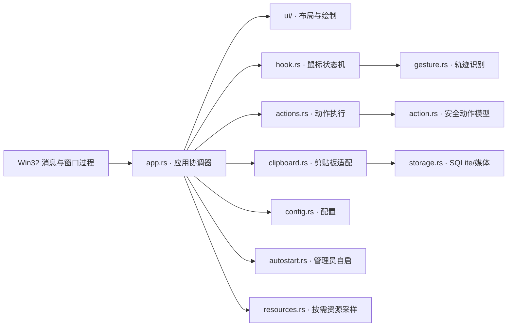
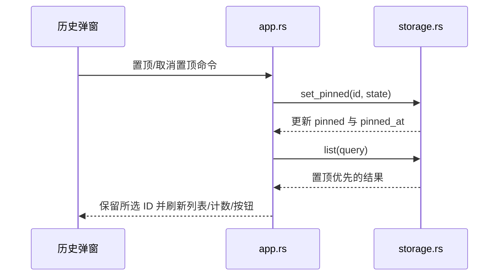

# Xmouse 工程架构

## 设计原则

Xmouse 是单进程、事件驱动的 Windows 原生程序。工程优先保证低常驻开销、安全的跨线程边界和可独立测试的核心逻辑。UI 层负责显示与输入转发，不直接实现手势识别、剪贴板持久化或动作执行。

```mermaid
flowchart LR
    Win32["Win32 消息与窗口过程"] --> App["app.rs · 应用协调器"]
    App --> UI["ui/ · 布局与绘制"]
    App --> Hook["hook.rs · 鼠标状态机"]
    App --> Actions["actions.rs · 动作执行"]
    Actions --> ActionModel["action.rs · 安全动作模型"]
    App --> Clipboard["clipboard.rs · 剪贴板适配"]
    Clipboard --> Storage["storage.rs · SQLite/媒体"]
    Hook --> Gesture["gesture.rs · 轨迹识别"]
    App --> Config["config.rs · 配置"]
    App --> Autostart["autostart.rs · 管理员自启"]
    App --> Resources["resources.rs · 按需资源采样"]
```

## 模块边界

| 模块 | 责任 | 不应承担 |
| --- | --- | --- |
| `app.rs` | 生命周期、窗口过程、状态协调、命令路由 | 控件布局细节、图片解码、数据库 SQL |
| `ui/settings.rs` | 设置页结构和控件句柄集合 | 配置持久化和业务判断 |
| `ui/gesture_settings.rs` | 手势页轨迹选择、动作绑定和训练控件布局 | 识别、执行和配置写入 |
| `ui/gesture_editor.rs` | 个性化轨迹画布、命中区域和纯绘制 | 配置写入和手势执行 |
| `ui/history_popup.rs` | 历史弹窗布局、搜索/列表/操作控件 | 历史查询和置顶写入 |
| `ui/history_preview.rs` | 大图缩放、Alpha 合成和预览窗绘制 | 磁盘查询和悬停状态判断 |
| `ui/history_view.rs` | 历史行与缩略图渲染 | 全局状态和窗口消息处理 |
| `ui/widgets.rs` | 可复用自绘控件与深色弹出菜单项 | 特定页面业务逻辑 |
| `ui/theme.rs` | 配色、字体、DWM/子控件主题 | 页面布局 |
| `ui/native.rs` | HWND 控件创建和公共原生操作 | 业务命令 |
| `storage.rs` | schema、迁移、查询、去重、置顶和淘汰 | UI 文案与窗口操作 |
| `gesture.rs` | 轨迹 ID、模板、个人样本归一化和识别 | 具体动作执行 |
| `action.rs` | 有限安全动作枚举与用户文案 | `SendInput`、窗口句柄和 UI 状态 |
| `actions.rs` | 轨迹绑定解析后的目标验证与动作执行 | 手势形状识别和任意脚本 |
| `autostart.rs` | 提权助手、最高权限登录任务和旧启动项迁移 | UI 状态、手势与剪贴板业务 |

依赖方向保持为 `app → ui/domain services`。纯绘制函数通过参数接收主题、字体和视图数据，不读取 `AppState`；这样可以独立调整页面而不影响钩子与存储线程。

## 线程模型

- UI 主线程运行 Win32 消息循环、托盘、设置页、历史弹窗、轨迹层与提示条。
- 鼠标钩子线程只执行状态判断、轨迹采样与消息投递，回调路径不访问数据库。
- 没有候选手势时，普通移动事件通过原子门控直接放行；触发按下时才读取配置并判定前台窗口是否为全屏应用。
- 动作线程负责识别后的窗口激活、输入注入和搜索动作。
- 剪贴板线程负责内容读取、图片处理、SQLite 写入和容量淘汰。
- 图片预览线程按需读取、解密并缩放悬停图片；空闲时阻塞等待，不轮询。

线程间使用 Rust 通道和 `WM_APP_*` 消息。UI 句柄只在 UI 线程操作；共享配置使用 `Arc<RwLock<AppConfig>>`。

钩子线程同时注册进程外 `EVENT_SYSTEM_FOREGROUND` WinEvent。前台切换且当前没有正在绘制的轨迹时，线程先安装新的 `WH_MOUSE_LL`，再原子替换并卸载旧句柄；这样可以恢复被 Windows 静默移除或在高完整性窗口期间受隔离的钩子。若前台一直不变，钩子线程使用 30 秒低频消息计时器重装一次，绘制中跳过。WinEvent 还记录最近活跃的非 Xmouse 顶层窗口及其进程规则命中状态，供“应用保护”页选择目标，并让常见的前台触发只做原子 PID/布尔值比较。后台窗口首次命中才按需查询进程名。不存在模拟心跳输入或高频空闲轮询；钩子热路径对配置和轨迹状态只尝试非阻塞锁，竞争时直接放行原始输入。

托盘图标在 `WM_CREATE` 初次注册，若 Explorer 尚未就绪则每秒重试，最多 60 次；收到系统的 `TaskbarCreated` 广播时重新注册。广播也可能由 DPI 变化产生，因此 `NIM_ADD` 失败时再尝试 `NIM_MODIFY`。注册结果和进程生命周期写入不含剪贴板正文的本地日志。

命中 `Shell_TrayWnd`、`Shell_SecondaryTrayWnd`、`NotifyIconOverflowWindow`、`TaskListThumbnailWnd`、`Xaml_WindowedPopupClass` 或 `#32768` 的右键直接交由 Windows，避免任务栏、托盘和系统菜单进入手势状态机。

应用保护规则只保存和匹配 EXE 文件名，大小写无关。命中指定进程或通用全屏规则后，触发按下事件直接交给 Windows，不创建候选轨迹。名单不会提升 Xmouse 权限；中等完整性进程在高完整性、受保护进程和 UAC 安全桌面中仍遵循 UIPI，并只要求安全失败。

管理员自启不使用 `requireAdministrator` 应用清单。设置保存时，`app.rs` 仅在开关变化或计划任务缺失时调用 `autostart.rs`；后者通过 Shell `runas` 启动同一可执行文件的一次性助手，并在单实例检查前处理内部参数。助手生成 UTF-16 任务 XML，再使用 `schtasks.exe` 创建当前用户 `ONLOGON + HIGHEST + InteractiveToken` 任务，动作固定为当前便携版路径和 `--startup`；XML 同时明确允许电池供电启动/运行并忽略重复实例。父进程等待助手退出，UAC 取消或任务失败时不保存新设置。正常启动只查询任务是否存在，不自动弹出 UAC；升级成功后清理旧版 `HKCU Run` 值。

## 持续质量边界

`docs/REGRESSION-TEST-PLAN.md` 是用户可见行为的稳定索引。每个修复或新功能先选择回归编号，再决定自动化或真实 Windows 验证；`scripts/verify-test-baseline.ps1` 防止测试数量静默减少，`scripts/quality.ps1` 统一格式、Clippy、Release 测试、最终可执行文件构建和可选剪贴板/覆盖率检查。显式构建步骤避免测试 Harness 已更新但交付 EXE 仍陈旧。GitHub Actions 使用 MSVC 和仅限 CI 的 bundled SQLite 特性生成 LCOV，普通便携版仍使用随包分发的 `sqlite3.dll`，不增加应用体积。

行覆盖率只衡量可执行 Rust 路径，不能证明低级钩子、DWM 合成、任务栏类名、焦点和 UIPI 行为正确；这些能力保留真实 Windows 必测项。下一轮优先把触发状态机、动作后端和历史 ViewModel 从 Win32 消息过程抽出，提高可测性，而不是为提高数字执行窗口 API。

键盘动作通过 `MapVirtualKeyW(MAPVK_VK_TO_VSC_EX)` 转换为硬件扫描码；四个方向键即使映射结果没有 `E0` 前缀，也显式设置 `KEYEVENTF_EXTENDEDKEY`，键盘事件的 `dwExtraInfo` 保持为零。鼠标钩子优先根据 `LLMHF_INJECTED` 放行所有注入事件，并保留自身事件标记作为额外防线，避免鼠标重放再次成为手势候选。`Ctrl` 组合键按“修饰键按下 → 普通键按下 → 普通键释放 → 修饰键释放”的顺序分次发送并保留短暂按压时间，以兼容 Flutter 等维护自身硬件键状态的桌面框架。

## 个性化手势数据流

用户在设置页画布中用左键绘制单笔轨迹。UI 只收集坐标；`gesture.rs` 将轨迹重采样为 64 点并归一化，再以 `UserGestureTemplate` 保存到版本化配置。每个动作最多保留 3 份个人样本，超限时替换最早一份。

动作线程在下一次手势到达时检测模板列表变化并热更新识别器；轨迹层使用同一份模板即时刷新预测。个人样本和内置模板共同参与“最高分 + 候选分差”判断，删除个人样本不会删除内置模板。

识别结果是稳定的 `GestureId`，不会直接携带动作。`AppConfig::action_for` 再把轨迹解析为 `ActionKind`；因此动作改绑不会污染识别模板或个人样本。动作集合是编译期白名单，不包含任意脚本、命令行或插件入口。

圆形轨迹在方向向量匹配前增加端点闭合度预筛选；端点差分别除以横纵跨度后计算归一化距离，55% 以内视为强闭合，避免椭圆比例或 DPI 拉伸改变分类。对 64 点轨迹执行固定上限的非相邻线段相交检测；存在交点且端点距离不超过 80% 时，圆形候选与开放模板共同竞争并获得 0.05 分加权。内置模板覆盖八个起点、顺逆时针与横纵椭圆；圆形相似度相对全局阈值放宽 0.04。强闭合轨迹只与圆形模板竞争，开放的 C 轨迹继续与其他开放轨迹比较，避免为了提高圆形容错而降低 C 的可靠性。

S 动作优先读取 UI Automation 选区。失败后动作线程保存 OLE `IDataObject`、发送 `Ctrl+C`，等待剪贴板序号变化且 Unicode 文本真正可读，再恢复原数据对象。整个过程暂停历史捕获，避免临时内容进入数据库。

## 剪贴板置顶数据流

```mermaid
sequenceDiagram
    participant UI as 历史弹窗
    participant App as app.rs
    participant DB as storage.rs
    UI->>App: 置顶/取消置顶命令
    App->>DB: set_pinned(id, state)
    DB-->>App: 更新 pinned 与 pinned_at
    App->>DB: list(query)
    DB-->>App: 置顶优先的结果
    App-->>UI: 保留所选 ID 并刷新列表/计数/按钮
```

数据库 schema 版本存入 SQLite `user_version`。版本 2 新增 `pinned` 和 `pinned_at`，迁移是幂等的；重复内容的 UPSERT 不修改这两个字段。淘汰只选择 `pinned = 0` 的记录，因此置顶内容只能由用户显式删除或清空。

历史查询由 `storage.rs::list_filtered` 接收搜索词、内容类型和来源应用。类型与来源在内容解密和缩略图解码前筛除；`ui/history_view.rs` 只接收过滤后的 `HistoryView` 并计算搜索高亮。选择记录后，`app.rs` 先同步写入剪贴板并关闭弹窗，再由 `actions.rs` 验证和激活原目标窗口后发送 `Ctrl+V`，激活失败时不会向当前前台窗口注入输入。

深色来源筛选继续使用原生 `HMENU` 和 `TrackPopupMenu`，仅将菜单项切换为 `ui/widgets.rs` 的 owner-draw 绘制，并通过 `MENUINFO` 设置背景刷。菜单保持同步模态和键盘命令语义，不创建额外窗口或渲染线程。筛选分段按钮更新状态时使用无背景擦除的同步重绘，避免 Common Controls 在 owner-draw 之前短暂填充系统白色。

## 后续拆分规则

- 新页面应建立独立 `ui/<page>.rs`，并返回一个页面控件集合。
- 新通用视觉组件应放入 `ui/widgets.rs`，接口只接受绘制输入和不可变显示状态。
- 新业务规则先进入对应领域模块，并通过单元测试验证，再由 `app.rs` 连接到 UI。
- 不在钩子回调、窗口绘制或 `WM_PAINT` 中执行磁盘 I/O、图片编码或阻塞等待。
- 实时手势预测复用 UI 已接收的降频轨迹点，不在低级鼠标钩子回调中运行识别器。
- 当 `app.rs` 出现新的独立窗口流程时，再拆出窗口控制器；不为单个小函数创建无意义模块。
