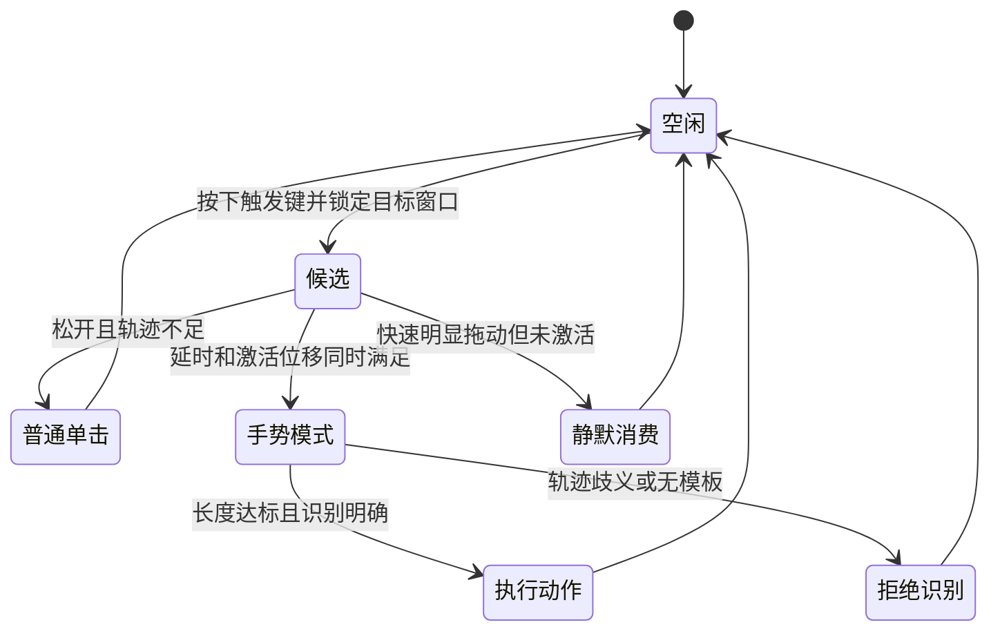

# Xmouse 产品需求与技术方案

> 文档版本：2.1
>
> 产品基线：Xmouse 0.13.1
>
> 下一目标版本：Xmouse 0.14.0
>
> 更新日期：2026-07-29
> 适用平台：Windows 10 22H2、Windows 11、x64

## 1. 文档目的

本文档统一描述 Xmouse 的产品定位、当前功能需求、交互规则、技术选型、质量指标和下一版本路线，用作后续设计、实现、测试和版本验收的依据。

Xmouse 0.13.1 是当前可用基线，已完成全屏游戏保护、剪贴板类型/来源筛选、深色菜单适配、选择后自动粘贴、九种个性化轨迹及有限安全动作绑定，并提高了自然过画圆与个性化圆形样本的容错。下一版不以堆叠功能为目标，重点提升规则精度、键盘/无障碍体验和长期存储稳定性。

## 2. 产品概述

### 2.1 产品定位

Xmouse 是一款 Windows 原生轻量效率工具，通过鼠标右键或侧键手势完成窗口置顶、关闭页面、搜索选中文本、复制内容、打开剪贴板历史、切换虚拟桌面、打开任务管理器和截图。

产品体验参考 Quicker 的快捷操作、浏览器鼠标手势和 Maccy 的剪贴板选择方式，但保持以下特点：

- 原生 Windows 桌面程序，不包含 WebView、Electron 或托管运行时。
- 常驻资源占用低，空闲时不轮询、不持续重绘。
- 默认配置开箱即用，主界面只显示常用设置。
- 所有数据保存在本机，不提供云同步、遥测或插件网络接口。
- 操作失败时安全退出，不向错误窗口发送按键。

### 2.2 目标用户

- 经常使用浏览器、资源管理器、编辑器和办公软件的 Windows 用户。
- 希望减少键盘与菜单操作，但不想安装大型自动化平台的用户。
- 需要可搜索的文本、图片剪贴板历史，并重视低资源占用的用户。

### 2.3 核心价值

1. 高频动作可以通过一次鼠标轨迹完成。
2. 普通右键单击保持原有行为，不破坏系统和应用习惯。
3. 剪贴板历史可快速检索、复制，并保留来源与时间信息。
4. 后台常驻成本足够低，用户无需因为性能原因手动退出。

## 3. 产品目标与边界

### 3.1 当前目标

- 可靠识别 ↑、L、S、C、V、←、→、7、○ 九个单笔手势。
- 支持右键、X1、X2 三种触发键。
- 支持文本与图片剪贴板历史。
- 支持按类型、来源应用和搜索词组合定位历史，并默认安全自动粘贴。
- 九条轨迹可分别学习个人样本并改绑有限安全动作。
- 提供浅色、深色现代化设置界面和历史弹窗。
- 支持开机启动、托盘管理、单实例和便携部署。
- 空闲 CPU 平均不高于 0.1%，私有内存不高于 30 MiB。

### 3.2 非目标

当前版本不提供：

- 跨平台支持、ARM64 或 32 位版本。
- 云同步、账号系统、遥测和应用内联网。
- 任意脚本、插件、命令执行或远程控制。
- 跨权限控制管理员窗口或 UAC 安全桌面。
- 反作弊、原始输入应用和窗口化游戏的完整兼容性承诺；全屏/无边框全屏默认安全停用手势。
- 富文本、文件列表或完整 Windows 剪贴板格式归档。

## 4. 核心用户场景

### 场景 A：保留普通右键

用户快速按下并松开右键，或只产生轻微抖动。Xmouse 应重放一次右键单击，应用仍然弹出原生菜单，不显示任何手势提示。

### 场景 B：执行窗口手势

用户按住触发键并向上移动。满足激活时间和距离后显示轨迹，松开时识别为 ↑，切换按下瞬间鼠标下窗口的置顶状态。

### 场景 C：搜索选中文本

用户在目标应用中选中文本后画 S。Xmouse 优先通过 UI Automation 读取选区；失败时在能够可靠保存原剪贴板的前提下临时复制，打开 Google 搜索后恢复剪贴板。

### 场景 D：使用剪贴板历史

用户画 V，在光标附近打开历史弹窗，通过类型、来源、搜索、方向键或鼠标选择记录。确认后写回剪贴板，验证并恢复原目标窗口，再默认发送 `Ctrl+V`；目标验证失败时只保留复制结果。

### 场景 E：处理浏览器冲突

Edge 或其他应用已使用右键手势时，用户可以关闭应用自带手势，或把 Xmouse 触发键改为 X1/X2。全屏/无边框全屏游戏默认自动停用手势；窗口化特殊应用的进程规则留给后续版本。

## 5. 功能需求

### 5.1 手势触发与状态机

| 编号 | 需求 |
| --- | --- |
| GST-001 | 默认触发键为右键，可切换为 X1 或 X2。 |
| GST-002 | 目标窗口固定为按下触发键瞬间鼠标下的顶层窗口。 |
| GST-003 | 默认激活延时为 180 ms，激活位移为 12 DIP。 |
| GST-004 | 有效手势轨迹默认至少为 28 DIP，且最大离起点距离至少为激活位移的 1.5 倍。 |
| GST-005 | 未达到有效轨迹门槛时重放普通单击，不进入识别、不显示“手势太快”。 |
| GST-006 | 已产生明显快速拖动但尚未进入手势模式时，静默消费，避免错误弹出右键菜单。 |
| GST-007 | 进入手势模式后显示轨迹；无法识别时提示“未识别手势”，不得执行近似动作。 |
| GST-008 | 自身通过 `SendInput` 注入的事件不得再次进入手势状态机。 |
| GST-009 | 提示条显示在鼠标所在显示器工作区的底部居中，1.3 秒后自动隐藏。 |
| GST-010 | 手势模式中、松开触发键之前显示当前预测动作；预测不得提前执行，最终动作仍以松开时的完整轨迹为准。 |
| GST-011 | 用户可为九条轨迹分别录制最多 3 份个人单笔样本，保存后立即参与最终识别和实时预测。 |
| GST-012 | 个人样本与内置模板共同匹配，不得绕过置信度和候选分差拒绝规则。 |
| GST-013 | 个人样本使用相同的 64 点归一化格式持久化；旧配置缺少该字段时自动使用空列表。 |
| GST-014 | 清除某条轨迹的个人样本后继续使用内置模板，不影响其他轨迹。 |
| GST-015 | 识别结果与执行动作分离；九条轨迹均可改绑有限安全动作或单独禁用。 |
| GST-016 | 旧版个人样本按原默认含义迁移到轨迹 ID，改绑动作不得删除或改变样本。 |
| GST-017 | 圆形在方向匹配前检查端点闭合度，并覆盖不同起点、方向和椭圆宽高比；不得降低 C 手势的拒绝边界。 |

### 5.2 内置手势

| 手势 | 动作 | 行为约束 |
| --- | --- | --- |
| ↑ | 切换窗口置顶 | 使用 `SetWindowPos(HWND_TOPMOST/HWND_NOTOPMOST)`。 |
| L | 关闭页面 | 激活目标窗口后只发送 `Ctrl+W`，不降级为 `Alt+F4`。 |
| S | 搜索选中文本 | 默认 Google；查询词使用 UTF-8/RFC 3986 编码。 |
| C | 复制 | 激活目标窗口后发送 `Ctrl+C`。 |
| V | 打开历史 | 打开历史弹窗；从手势或托盘打开时选择后自动粘贴，从设置页打开时只复制。 |
| ← | 右侧虚拟桌面 | 按拖动画布直觉发送系统快捷键 `Win+Ctrl+→`。 |
| → | 左侧虚拟桌面 | 按拖动画布直觉发送系统快捷键 `Win+Ctrl+←`。 |
| 7 | 任务管理器 | 发送系统快捷键 `Ctrl+Shift+Esc`。 |
| ○ | 截图 | 发送系统快捷键 `Win+Shift+S`，不显示可能进入截图的置顶提示。 |

### 5.3 手势识别

- 单笔轨迹重采样为 64 点。
- 对轨迹进行平移和尺度归一化，保留旋转方向信息。
- 使用方向向量余弦相似度与多模板匹配。
- 默认置信度阈值为 0.82。
- 圆形闭合距离按横纵跨度分别归一化，上限为 0.55；存在非相邻线段交点且端点距离不超过 0.80 时，圆形候选加 0.05 分但仍与开放模板竞争；圆形相似度门槛相对全局阈值放宽 0.04，其他手势不得继承这些放宽值。
- 第一、第二候选分差不足 0.06 时拒绝执行。
- 模板测试应覆盖缩放、位移、速度、抖动和多 DPI 环境。
- 设置页提供左键绘制画布，避免录制过程与当前右键/X1/X2 全局触发键冲突。

### 5.4 剪贴板历史

| 编号 | 需求 |
| --- | --- |
| CLP-001 | 通过 `AddClipboardFormatListener` 接收变更，不使用定时轮询。 |
| CLP-002 | 支持 `CF_UNICODETEXT`、PNG、`CF_DIBV5/CF_DIB`。 |
| CLP-003 | 文本和图片按内容哈希去重，重复内容移动到最新位置。 |
| CLP-004 | 默认最多 200 条、总逻辑内容 256 MiB；超限时淘汰最旧记录。 |
| CLP-005 | 文本单条最多 1 MiB；图片输入最多 64 MiB，存储最多 20 MiB。 |
| CLP-006 | 默认明文保存；用户可选择对新记录使用当前用户 DPAPI 加密。 |
| CLP-007 | 历史弹窗支持即时搜索、文本预览、图片缩略图、来源和时间。 |
| CLP-008 | 支持方向键、Enter、单击复制、Delete 删除、Esc 关闭和清空确认。 |
| CLP-009 | 右上角显示记录总数及数据库、WAL、共享内存和媒体文件的实际占用。 |
| CLP-010 | 尊重 Windows 禁止剪贴板历史/监控的格式标记。 |
| CLP-011 | S 手势的临时复制与恢复事件不得写入历史。 |
| CLP-012 | 支持置顶与取消置顶；置顶项优先显示，重复内容更新不得丢失置顶状态。 |
| CLP-013 | 置顶项不参与普通容量淘汰且不能直接删除；必须先取消置顶才能单条删除或清空。 |
| CLP-014 | 悬停图片记录时异步显示大图预览；离开、搜索或关闭历史后自动隐藏。 |

### 5.5 设置与系统集成

- 常规页只显示启用状态、开机启动、深色模式和触发键。
- 剪贴板页显示记录开关、本机加密和历史管理入口。
- 个性化手势页显示动作选择、样本数量、绘制画布和当前动作清除入口。
- 资源页显示 CPU、GPU、私有内存、工作集、PID、句柄和运行时间。
- 高级识别参数保留在版本化 JSON 配置中，不直接暴露给普通用户。
- 开机启动写入当前用户 `HKCU\Software\Microsoft\Windows\CurrentVersion\Run`，不要求管理员权限。
- 开机启动已启用时，程序应在启动阶段修复可执行文件路径。
- 使用命名互斥量保证单实例；再次启动时激活已有设置窗口。
- 关闭设置窗口只隐藏到托盘；从托盘菜单明确退出进程。

### 5.6 主题与视觉

- 支持浅色和深色主题，并同步作用于设置页、历史弹窗、标题栏、搜索框和列表。
- 深色主题必须覆盖来源应用弹出菜单；分段筛选按钮切换不得先擦除为系统白色。
- 使用简洁侧边栏、圆角卡片、自绘开关和分段按钮。
- 保证 100%、150%、200% DPI 及多显示器布局不截断。
- 使用 `Microsoft YaHei UI` 显示简体中文。
- 操作状态通过非模态短提示反馈；错误确认或危险清空操作可使用模态对话框。

## 6. 非功能需求

### 6.1 性能

| 指标 | 目标 | 0.7.0 实测基线 |
| --- | --- | --- |
| 空闲 CPU | 平均 ≤ 0.1% | 20.28 秒内 CPU 增量低于本机计时分辨率 |
| 空闲私有内存 | ≤ 30 MiB | 平均/峰值 2.24 MiB |
| 空闲工作集 | 参考指标 | 平均/峰值 14.65 MiB |
| 后台线程 | 尽量固定且无忙等 | 个性化模板未增加轮询线程 |
| 钩子回调 | p99 < 1 ms | 回调只采样、判断并投递消息 |
| 200 条历史打开内存 | ≤ 80 MiB | 发布前持续回归 |

资源采样只在资源页可见时每秒执行一次；其他页面和后台状态不得为此新增轮询。

### 6.2 可靠性

- 目标窗口激活失败时不得向其他前台窗口发送快捷键。
- 提权窗口受 UIPI 阻止时安全失败，不自动请求管理员权限。
- 配置损坏时备份原文件并恢复默认配置。
- SQLite 损坏时备份数据库并重建可用数据库。
- 配置使用临时文件加原子替换，避免中途退出产生半写文件。
- 日志禁止记录剪贴板正文。

### 6.3 兼容性

- Windows 10 22H2、Windows 11、x64。
- Per-Monitor V2 DPI。
- 支持 Edge、资源管理器、记事本和普通桌面程序。
- 管理员窗口、UAC 安全桌面、游戏和原始输入程序只要求安全失败。

### 6.4 隐私与安全

- 默认不联网；搜索动作只把 URL 交给默认浏览器。
- 剪贴板历史只保存在 `%LOCALAPPDATA%\Xmouse`。
- 明文模式方便个人调试；DPAPI 模式只允许当前 Windows 用户解密。
- 不开放脚本、插件、远程控制或任意命令接口。

## 7. 技术架构

### 7.1 进程与线程

| 组件 | 职责 |
| --- | --- |
| UI 主线程 | Win32 消息循环、设置窗口、托盘、历史弹窗、轨迹层、提示条和隐藏消息窗口。 |
| 鼠标钩子线程 | 安装 `WH_MOUSE_LL`，执行轻量状态判断、预分配轨迹采样和消息投递。 |
| 动作工作线程 | 手势识别、窗口激活、按键注入、搜索和历史弹窗请求。 |
| 剪贴板工作线程 | 读取剪贴板、PNG 转换、缩略图、SQLite 写入和淘汰。 |

线程之间使用 Rust 通道及 Win32 自定义消息通信。钩子回调不执行数据库、图片解码、网络或复杂 UI 操作。

### 7.2 技术选型

#### Rust

选择 Rust stable 作为主要语言：

- 生成原生 x64 程序，无 GC 暂停和托管运行时。
- 所有权与类型系统适合管理钩子状态、跨线程数据和 Win32 资源生命周期。
- Release 可执行文件体积和常驻内存符合轻量目标。
- Cargo 能统一依赖、测试、构建和版本锁定。

#### Windows API：`windows-rs` 与 `windows-sys`

微软的 [`windows-rs`](https://github.com/microsoft/windows-rs) 同时提供较安全的 `windows` 绑定和原始 C 风格 `windows-sys` 绑定。Xmouse 对 COM、OLE、UI Automation 使用 `windows`，对高频 Win32 消息、钩子和 GDI 路径使用 `windows-sys`。

主要系统接口包括：

- [`WH_MOUSE_LL` / LowLevelMouseProc](https://learn.microsoft.com/windows/win32/winmsg/lowlevelmouseproc)：全局鼠标事件。
- [`SendInput`](https://learn.microsoft.com/windows/win32/api/winuser/nf-winuser-sendinput)：快捷键和鼠标单击重放。
- [`SetWindowPos`](https://learn.microsoft.com/windows/win32/api/winuser/nf-winuser-setwindowpos)：置顶状态切换。
- [`AddClipboardFormatListener`](https://learn.microsoft.com/windows/win32/api/winuser/nf-winuser-addclipboardformatlistener)：事件驱动剪贴板监听。
- UI Automation：优先读取应用选中文本。
- OLE `IDataObject`：保存、临时替换和恢复剪贴板。

#### UI：Win32/GDI 自绘

0.7.0 使用原生 HWND、GDI、自绘按钮、Common Controls v6、DWM 深色标题栏和 Per-Monitor V2 DPI。

选择理由：

- 与托盘、全局钩子、剪贴板监听和隐藏消息窗口共享同一个 Win32 消息模型。
- 没有 WebView、XAML 运行时或持续 GPU 渲染循环。
- 当前实测资源显著低于目标。
- 通过自绘可统一开关、卡片、导航和分段按钮的圆角视觉。

代价是布局、焦点、键盘导航、无障碍和主题细节需要手动实现。0.7.0 已将 UI 拆分为主题、原生控件、通用组件、设置页、个性化画布、历史弹窗、图片预览、历史行与格式化模块；下一版继续补足键盘焦点和无障碍信息。

#### 数据：SQLite + 文件媒体

- `rusqlite` 访问 SQLite，便携包附带 `sqlite3.dll`。
- SQLite 保存元数据、文本、来源、时间、大小和内容编码。
- 图片以哈希命名保存在 `media` 目录；明文为 PNG，加密为 DPAPI 二进制文件。
- WAL 模式降低读取与后台写入冲突。
- SHA-256 用于去重。

#### 图片处理

Rust `image` crate 负责 PNG 编解码、DIB 转换和缩略图生成。图片工作放在后台线程，避免阻塞钩子与 UI 消息循环。

#### 配置与日志

- `serde` / `serde_json` 读写版本化配置。
- `MoveFileExW` 完成临时文件原子替换。
- 日志轮转，只记录动作类别、错误和运行状态，不记录剪贴板正文。

### 7.3 UI 框架调研结论

| 方案 | 优点 | 主要代价 | 当前结论 |
| --- | --- | --- | --- |
| Win32/GDI 自绘 | 资源最低、与现有架构直接兼容、部署简单 | 手工布局和无障碍成本高 | 继续使用已模块化的现有实现 |
| [WinUI 3](https://learn.microsoft.com/windows/apps/winui/winui3/) | 微软现代原生 UI、Fluent/XAML、控件完整 | Windows App SDK、XAML/C++ 或 C# 集成和部署复杂度 | 适合单独原型，不在 0.8.0 全量迁移 |
| [Winio](https://github.com/compio-rs/winio) | Rust 原生 Windows 控件抽象，可作为现代原生路线候选 | 需要验证成熟度、控件覆盖和现有消息循环集成 | 建议做小型历史弹窗 PoC |
| [Native Windows GUI](https://github.com/gabdube/native-windows-gui) | Win32 的轻量 Rust 包装，资源模型相近 | 仍以传统 Win32 控件为主，不能直接解决视觉问题 | 不迁移 |
| [Slint](https://github.com/slint-ui/slint) | 声明式 UI、稳定 1.x API、多种渲染后端 | 新 DSL、运行/渲染层和许可证组合需评估 | 可做独立 UI 原型，不进入 0.8.0 主线 |
| [egui](https://github.com/emilk/egui) | Rust 生态成熟、快速开发、自绘能力强 | 即时模式且不以原生外观为目标 | 不符合 Xmouse 原生常驻工具定位 |
| [Iced](https://github.com/iced-rs/iced) | Elm 风格、响应式布局、wgpu/tiny-skia 后端 | 项目仍标注实验性，引入完整渲染与窗口层 | 不进入当前主线 |

结论：保留 Win32/GDI 核心和已完成的 UI 模块边界。只有当 Winio 或 WinUI 3 原型在功能、体积、启动时间和内存上同时通过基线，才考虑后续迁移设置窗口；鼠标钩子、动作和剪贴板后端无需随 UI 重写。

## 8. 数据模型概览

### 8.1 配置

配置文件：`%LOCALAPPDATA%\Xmouse\config.json`

主要分组：

- 运行：启用、深色模式、开机启动。
- 手势：触发键、延时、激活距离、最短轨迹、置信度、轨迹显示和个人 64 点模板。
- 搜索：URL 模板。
- 历史：记录开关、加密、数量与容量上限、单条限制、排除程序。

### 8.2 历史记录

| 字段类别 | 内容 |
| --- | --- |
| 标识 | 自增 ID、SHA-256 内容哈希 |
| 类型 | text / image |
| 内容 | 明文文本、DPAPI 文本或媒体文件名 |
| 预览 | 图片缩略图及编码方式 |
| 来源 | 来源进程名 |
| 属性 | 图片宽高、逻辑字节数 |
| 时间 | 创建时间、最后使用时间 |
| 置顶 | `pinned` 状态、最近置顶时间 `pinned_at` |

## 9. 当前版本验收基线

- 39 项常规 Release 单元测试和 1 项真实剪贴板往返测试通过。
- 0.13.0 的 50.36 秒后台空闲基线为：CPU 增量 0、平均私有内存 2.285 MiB、平均工作集 14.069 MiB。
- ↑、L、S、C、V、←、→、7、○ 的每一份内置模板均支持缩放和抖动测试；左右横线保持方向敏感，圆形覆盖起点、顺逆时针、椭圆、轻微未闭合与适度过画轨迹。
- 快速右键只重放一次普通单击。
- 短轨迹与轻微抖动不显示取消提示。
- 全屏/无边框全屏前台窗口默认放行鼠标输入，普通最大化窗口不误判。
- 深色主题同步覆盖设置页和历史弹窗。
- 深色来源菜单无浅色底，文本/图片筛选切换无白闪。
- 历史支持文本/图片、来源应用和搜索词组合过滤，搜索命中词高亮。
- 自动粘贴只向通过验证的原目标窗口发送 `Ctrl+V`，失败时保留复制结果。
- 资源页只在可见时采样。
- 置顶项优先显示、去重时保持置顶，并在普通容量淘汰后继续存在。
- 深色模式冷启动无白底残留；图片悬停预览和手势实时预测可见且不抢焦点。
- 置顶项在存储层拒绝删除和清空，取消置顶后才能删除。
- 轨迹 ID 与动作绑定分离，旧个人样本兼容迁移，重复动作映射被拒绝。
- 便携包解压后可独立启动，源码包和 SHA-256 校验文件有效。

## 10. Xmouse 0.14.0 建议路线

### 10.1 推荐主题

**主题：在不增加常驻成本的前提下，补齐长期使用和可访问性。**

0.10–0.13 已完成本轮用户确认的游戏保护、剪贴板增强、深色筛选修复、九种轨迹和有限动作绑定。0.14 建议以稳定性和细节质量为主，不进行 UI 框架整体迁移。

| 优先级 | 改进项 | 用户价值 | 工作量 | 建议验收 |
| --- | --- | --- | --- | --- |
| P0 | 键盘导航与无障碍 | 不依赖鼠标也能完整操作设置和历史 | M | Tab 顺序、焦点框、名称和高对比度模式完整 |
| P0 | 存储维护 | 长期运行后数据库和媒体目录仍可控 | M | WAL checkpoint、孤立媒体清理、备份/恢复测试 |
| P1 | 跟随系统主题 | 自动匹配 Windows 外观 | S | 浅色/深色/跟随系统三种模式，切换无残影 |
| P1 | 窗口化游戏排除 | 补齐全屏判定覆盖不到的游戏模式 | M | 独立手势排除列表，不复用剪贴板排除项 |
| P1 | 全局历史快捷键 | 不画 V 也能打开历史 | S | 默认关闭；用户自选组合，冲突时明确提示 |
| P1 | 历史搜索优化 | 200 条以上仍保持即时反馈 | S | 输入防抖、查询取消和大图延迟解码 |
| P2 | 轻量诊断 | 仅在确有兼容问题时辅助定位 | S | 默认隐藏，不记录剪贴板正文 |

工作量说明：S 为局部功能，M 涉及一个子系统，L 涉及交互、算法和持续测试。

### 10.2 重点需求建议

#### A. 按应用规则

只解决全屏保护无法覆盖的窗口化游戏和特殊程序：

- 规则仅支持“在此应用禁用手势”，不在下一版加入按应用切换侧键。
- 匹配进程文件名；用户从当前前台进程添加，避免手输路径。
- 钩子回调使用预处理后的只读规则，不能在回调中访问磁盘。
- Edge 自带手势已由用户关闭，不增加针对 Edge 的特殊逻辑。

#### B. 个性化手势后续校准

自动校准工作量较大，放到 0.14 或以后。校准不重新暴露延时、距离、置信度等专业参数，而采用引导式样本：

1. 画 3 次普通右键点击/轻微移动。
2. 画 3–5 次常用手势。
3. 根据样本分布计算激活距离和最短轨迹。
4. 将结果限制在安全范围内，并提供“恢复默认”。

算法改进可包括 Ramer–Douglas–Peucker 简化、起始方向预筛选和按手势独立阈值，但必须保持不确定轨迹拒绝执行的原则。

#### C. 历史快捷键与搜索增强

- 0.11 已完成置顶、图片预览、类型/来源筛选、搜索高亮和安全自动粘贴。
- 提供可配置全局快捷键，建议默认 `Ctrl+Alt+V`，避免占用系统 `Win+V`。
- 快捷键默认关闭；开启时沿用当前自动粘贴目标验证。
- 大量图片场景优先减少同步缩略图解码，不扩展富文本和文件列表。

#### D. UI 工程化

0.12 已形成以下边界：

- `ui/theme.rs`：主题、颜色、字体和 DWM 设置。
- `ui/settings.rs`：设置页面与导航。
- `ui/gesture_settings.rs`：轨迹选择、动作绑定和训练页布局。
- `ui/history_popup.rs`、`ui/history_view.rs` 与 `ui/history_preview.rs`：历史布局、列表与大图预览。
- `ui/widgets.rs`：开关、分段按钮、卡片和提示条。
- `ui/native.rs` 与 `ui/format.rs`：Win32 控件基础设施和纯格式化逻辑。
- `gesture.rs` / `action.rs` / `actions.rs`：识别、动作模型和执行分离。

下一阶段只在出现新的独立窗口流程时拆控制器，并优先把历史筛选状态和手势绑定状态抽成可测试 ViewModel；不为追求文件数量进行机械拆分。

### 10.3 不建议放入 0.14.0

- 整体迁移 WinUI 3、Slint、egui 或 Iced。
- 任意脚本、插件或命令绑定。
- 云同步、账号系统、自动更新。
- 可录制任意复杂多笔手势。
- 自动手势阈值校准。
- 按应用改用 X1/X2。
- 安装服务或自动提升管理员权限。

这些项目会扩大安全、部署或资源边界，应在核心稳定性完成后独立评估。

## 11. 后续版本展望

### 0.14.x 候选

- 引导式手势自动校准与恢复默认。
- 个人样本冲突提示，但不显示复杂专业参数。
- 可选历史导出/导入，明确明文与 DPAPI 数据边界。

### 1.0.0 条件

- 手势误执行率低于 1%，核心手势正确率至少 90%。
- 长期运行、休眠恢复、Explorer 重启和数据库迁移稳定。
- 设置、历史和托盘具备完整键盘导航与无障碍名称。
- 便携包、升级说明、卸载说明和隐私说明完整。
- 性能目标在 Windows 10/11 的多台机器上复测通过。
- 再评估安装器、代码签名和自动更新；这些不提前进入 0.x 功能迭代。

## 12. 0.14.0 验收建议

- 窗口化游戏排除规则命中后完全放行鼠标事件，未命中应用无额外轮询。
- 系统主题变化后 500 ms 内完成主窗口和历史弹窗同步，无控件残影。
- 全局快捷键注册失败时不覆盖其他应用，界面显示冲突原因。
- 数据库维护、备份和恢复不丢失置顶、来源和内容编码状态。
- 200 条历史下搜索输入、主题切换和弹窗打开无明显卡顿。
- 后台空闲 CPU、私有内存和钩子热路径不劣于 0.13.0 基线。

## 13. 已确认产品决策

1. 游戏优先级最高；先完成通用全屏保护，窗口化游戏规则后续补齐。
2. 暂不实现“指定应用只使用侧键”。
3. 剪贴板类型/来源筛选、搜索高亮和默认自动粘贴已经完成。
4. 动作自定义只开放固定安全白名单；现有轨迹和个人样本可以改绑，不开放任意脚本。
5. 自动手势校准后置，诊断页低优先级。
6. 安装器、代码签名、自动更新和正式分发放到 1.0 或以后评估。
7. 左右桌面手势按拖动画布方向对调；新增 7 打开任务管理器、圆形打开截图层。
8. 深色历史筛选按钮和来源应用菜单不得出现浅色闪烁或未适配区域。
